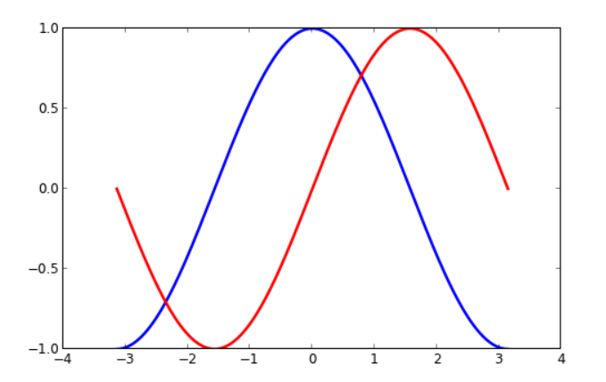
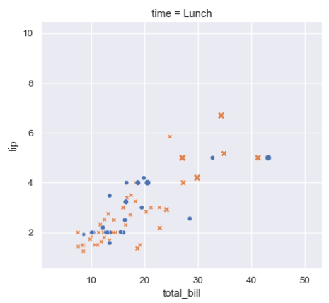
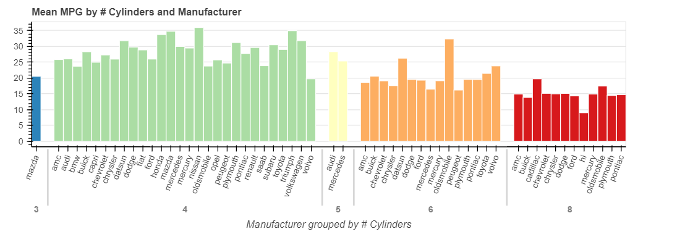
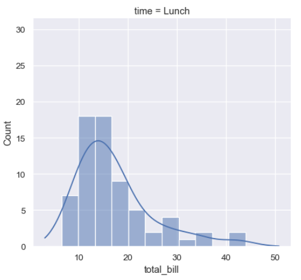
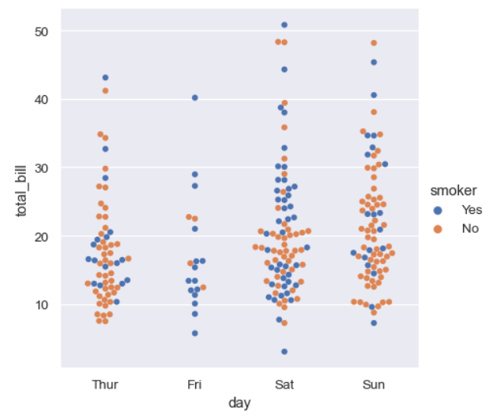

### What are the key differences between Matplotlib, Seaborn, and Bokeh libraries in terms of their features and use cases? Provide an example of a specific visualization that is more suitable for each library.


#### **Differences:**

#### Matplotlib:
*matplotlib is probably the single most used Python package for 2D-graphics. It provides both a very quick way to visualize data from Python and publication-quality figures in many formats.*

```
import numpy as np

X = np.linspace(-np.pi, np.pi, 256, endpoint=True)
C, S = np.cos(X), np.sin(X)

plt.figure(figsize=(10,6), dpi=80)
plt.plot(X, C, color="blue", linewidth=2.5, linestyle="-")
plt.plot(X, S, color="red",  linewidth=2.5, linestyle="-")

```



<br/>

#### Seaborn:
*Seaborn is a library for making statistical graphics in Python. It builds on top of matplotlib and integrates closely with pandas data structures.*

*Seaborn helps you explore and understand your data. Its plotting functions operate on dataframes and arrays containing whole datasets and internally perform the necessary semantic mapping and statistical aggregation to produce informative plots.*

```
# Import seaborn
import seaborn as sns

# Apply the default theme
sns.set_theme()

# Load an example dataset
tips = sns.load_dataset("tips")

# Create a visualization
sns.relplot(
    data=tips,
    x="total_bill", y="tip", col="time",
    hue="smoker", style="smoker", size="size",
)

```



<br/>

#### Bokeh:

*Bokeh is an interactive visualization library that targets modern web browsers for presentation. It is good for:*

* Interactive visualization in modern browsers
* Standalone HTML documents, or server-backed apps
* Expressive and versatile graphics
* Large, dynamic or streaming data
* Easy usage from python (or Scala, or R, or...)

```
# Standard imports 
from bokeh.io import output_notebook, show
output_notebook()

# Plot a complex chart with interactive hover in a few lines of code
from bokeh.models import ColumnDataSource, HoverTool
from bokeh.plotting import figure
from bokeh.sampledata.autompg import autompg_clean as df
from bokeh.transform import factor_cmap

df.cyl = df.cyl.astype(str)
df.yr = df.yr.astype(str)

group = df.groupby(by=['cyl', 'mfr'])
source = ColumnDataSource(group)

p = figure(width=800, height=300, title="Mean MPG by # Cylinders and Manufacturer",
           x_range=group, toolbar_location=None, tools="")

p.xgrid.grid_line_color = None
p.xaxis.axis_label = "Manufacturer grouped by # Cylinders"
p.xaxis.major_label_orientation = 1.2

index_cmap = factor_cmap('cyl_mfr', palette=['#2b83ba', '#abdda4', '#ffffbf', '#fdae61', '#d7191c'], 
                         factors=sorted(df.cyl.unique()), end=1)

p.vbar(x='cyl_mfr', top='mpg_mean', width=1, source=source,
       line_color="white", fill_color=index_cmap, 
       hover_line_color="darkgrey", hover_fill_color=index_cmap)

p.add_tools(HoverTool(tooltips=[("MPG", "@mpg_mean"), ("Cyl, Mfr", "@cyl_mfr")]))

show(p)


```



<br/>

### In the Seaborn library, what are the main functions to create relational, categorical, and distribution plots? Briefly explain the purpose of each type of plot and provide an example use case.
<br/> 


`sns.relplot()` is a function in Seaborn that allows you to create various types of relational plots. It is a flexible function that can create scatterplots, lineplots, and other types of plots that show the relationship between two variables.

`sns.distplot()` Plots the distribution of a single variable, showing its frequency distribution and the density estimate.

`sns.catplot()` is a function in Seaborn that allows you to create various types of categorical plots. It is a high-level interface that provides several options for creating different types of categorical plots, including strip plots, swarm plots, box plots, violin plots, and more.

<br/>


```
# relational: 
sns.relplot(
    data=tips,
    x="total_bill", y="tip", col="time",
    hue="smoker", style="smoker", size="size",
)

# distribution:
sns.displot(data=tips, x="total_bill", col="time", kde=True)

# categorical:
sns.catplot(data=tips, kind="swarm", x="day", y="total_bill", hue="smoker")

```
<br/>

**relational**

 

**distribution**

 

**categorical**

 

<br/>

### Discuss the role of the Seaborn Cheat Sheet in a Python developer’s workflow. What are some key sections or elements featured in the cheat sheet that can help a developer quickly reference Seaborn functionalities?

*The Seaborn Cheat Sheet is a quick reference guide that summarizes the most commonly used Seaborn functions and their parameters. It is a useful tool for Python developers who are working with Seaborn and want to quickly look up the syntax for specific functions or parameters.*

**Sections:**
1. Data
2. Figure Aesthetics
3. Plotting with Seaborn
4. Further Customizations
5. Show or Save Plot

