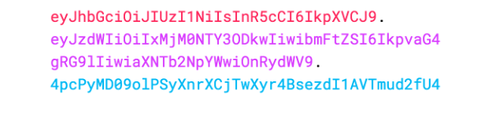

## What is the primary purpose of JSON Web Tokens (JWTs) and how do they work in terms of encoding and decoding data?

<br>

### Purpose:

**Information Exchange:** JSON Web Tokens are a good way of securely transmitting information between parties. Because JWTs can be signed—for example, using public/private key pairs—you can be sure the senders are who they say they are. Additionally, as the signature is calculated using the header and the payload, you can also verify that the content hasn't been tampered with.

### How?
The output(header, payload, signature) is three Base64-URL strings separated by dots that can be easily passed in HTML and HTTP environments

this is the encoded output:


to decode it you can use ```jwt.io Debugger```

## How does JWT Authentication integrate with Django REST Framework to secure API endpoints, and what are the key components involved in this process?

### How?

JWT: JSON Web Tokens are a compact and self-contained mechanism for transmitting authentication information securely between parties as a JSON object. 

DRF: Django REST Framework is a powerful toolkit for building web APIs in Django. 

Django Authentication: DRF leverages Django's authentication system, which includes user models, authentication backends, and authentication middleware. Django provides built-in authentication mechanisms like session-based authentication and token-based authentication.

### Components:
### Views, Urls

## Why is Django’s built-in runserver not suitable for production environments, and what are some alternative server options that should be considered for deploying a Django application?

### Why?
 The server started with runserver is not guaranteed to be performant (it’s very slow), and it hasn’t been built with security concerns in mind. Not a good fit for production use.

 ### What?
Use a production-ready web server like Nginx, and let your app be handled by a WSGI application server like Gunicorn.

If you plan on running on Heroku, a web server is provided implicitly. You don’t have to take care of it.